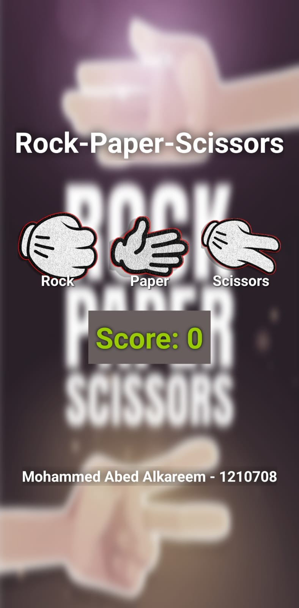
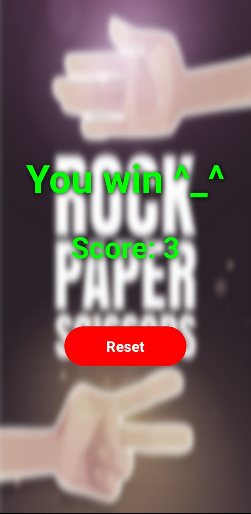

# Rock-Paper-Scissors Game

This repository contains the implementation of a Rock-Paper-Scissors game developed using Android Studio for the Advanced Computer Systems Engineering Laboratory (ENCS5150) course. The game is designed with a user-friendly interface and robust game logic, ensuring a seamless user experience.

## Features

- **Main Activity**:
  - Title: "Rock-Paper-Scissors"
  - Game choice buttons: Rock, Paper, Scissors (each with text and image)
  - Cumulative score display
  - Adversary choice image (initially hidden)
  - User information display (name and ID)

- **Result Activity**:
  - Feedback display ("You Won!" or "You Lost!")
  - Score display
  - Reset button to return to the main activity

## Screenshots


Main Activity                                                       |  Result Activity
:---------------------------------------------------------------:|:---------------------------------------------------------------:
  |  


## Game Logic

- Adversary choice is randomized.
- Score updates based on game outcomes:
  - Win: +3 points
  - Draw: +1 point
  - Loss: -4 points
- Transition to result activity 5 seconds after the user makes a choice.
- Reset button returns to the main activity without resetting the score.

## Design Considerations

- Clear and intuitive interface
- PNG images with transparent backgrounds
- Compliance with specified color and design requirements
- Exactly two activities in the application

## Requirements

- Android Studio
- Minimum SDK: API 26
- Target Device: Pixel 3a XL with API Level 26 (Graphic=Software)

## Installation

1. Clone the repository:
   ```sh
   git clone https://github.com/your-username/Rock-Paper-Scissors.git
   ```
2. Open the project in Android Studio.
3. Build the project and generate the APK file:
   ```sh
   Build → Build Bundle(s) / APK(s) → Build APK(s)
   ```

## Usage

- Install the APK on an emulator or a physical device.
- Launch the application and start playing the Rock-Paper-Scissors game.
- Monitor your score and reset the game as needed.

## Sample Run


## License

This project is licensed under the MIT License. See the LICENSE file for details.
